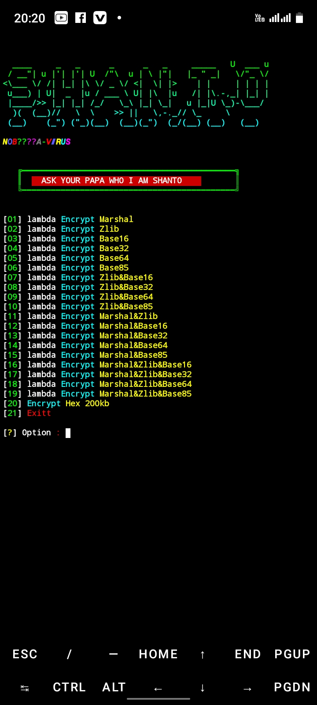

</p>
   <p align="center">
      <a href="https://github.com/Dark-Cyber-07/DARK-ENC/stargazers">
      </a>
      <a href="https://github.com/Dark-Cyber-07/DARK-ENC/releases/latest">
      </a>
      <a href="https://www.conventionalcommits.org/en/v1.0.0/">
      </a>
      <a href="https://github.com/Dark-Cyber-07/DARK-ENC/actions/workflows/github-action.yml">
      </a>
   </p>

> THIS IS A SIMPLE  PY2 && PY3 OBFUSCATE  TOOLS 


### INSTALL TOOL TERMUX
```python
apt update && apt upgrade -y
pkg install git
pkg install python
pip install requests
rm -rf DARK-ENC
git clone --depth=1 https://github.com/Dark-Cyber-07/DARK-ENC.git
cd DARK-ENC
python ENC.py
```
### CREATOR ADMIN PROFILE >


<h5 align="center"><b>TERMUX > </b></h5>

<p align="center">

### Languages >

</a>

<br>
<a href="https://github.com/Dark-Cyber-07/DARK-ENC">
  
</a>

<h5 align="center"><b>DESCRIPTION</b></h5>

> [!NOTE]  
> All the tools are belongs to their copyright owner, and this use is in accordance with the terms and conditions of the copyright holder.

# Give A Star ⭐

> You can also give this repository a star to show more people and they can use this repository
